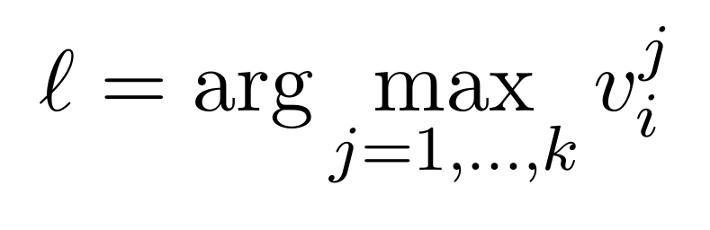

# KMeans-SpectralClustering
This project performs clustering analysis on a 2D dataset, applying K-means and spectral clustering algorithms. It includes visualizations of cluster formations, error functions, and Voronoi regions, with a focus on exploring clustering techniques in two-dimensional space (R²)

### PART I :
This section involves implementing a custom K-means algorithm with 𝐾=2 and experimenting with 5 different random initializations. The objective is to study the behavior of the error function across iterations for each initialization. Additionally, the clusters obtained from each run will be plotted in different colors to visually analyze the clustering results and their consistency.

### PART II : 
This section involves fixing a random initialization and then applying the K-means algorithm for different values of 𝐾(2, 3, 4, 5). For each value of
𝐾, the cluster centers are obtained based on the fixed initialization. The Voronoi regions corresponding to each cluster center are then plotted, providing a visual representation of how the space is divided among the clusters for each 
𝐾.

### PART III :
This section involves running the spectral clustering algorithm, which is a spectral relaxation of K-means using Kernel PCA, with 𝑘 = 2. An appropriate kernel is selected for the dataset, and the resulting clusters are plotted in different colors. This visualization helps in understanding the effectiveness of the chosen kernel in capturing the underlying data structure.

### PART IV :
This section explores an alternative method for mapping eigenvectors to cluster assignments, deviating from the standard approach in spectral clustering. Instead of the usual method, each data point 𝑖 is assigned to the cluster corresponding to  

where
𝑣
𝑗
∈
𝑅
𝑛
is the eigenvector of the kernel matrix associated with thej-th largest eigenvalue. The performance of this mapping on the dataset is analyzed, and insights into its effectiveness and behavior are discussed.
